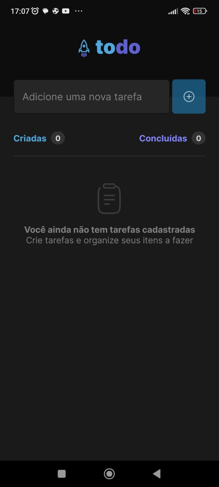
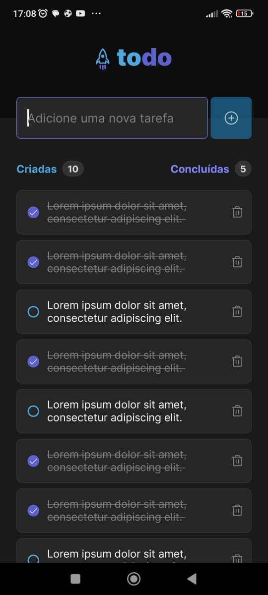

<h1 align="center">ToDo</h1>

O programa Todo foi criado com o intuito de compreender mais sobre os fundamentos do React Native como componentes, hooks como o useState e propriedades. O programa foi criado para que usuários possam criar suas tarefas e marcar como concluídas e apagá-las se quiser.

 

# 🚀 Tecnologias

Projeto desenvolvido com as seguintes tecnologias:

- React Native
- TypeScript
- StyleSheet
- Expo
- Git e Github
- Figma

 

# 💻 Principais issues

- Criar o código JSX
- Criar tarefas
- Mostrar tarefas criadas em tela
- Apagar tarefas
- Configurar a quantidade de tarefas criadas e concluídas
- Validar formulário

  

<h2>Versão Mobile:</h2>

  

   

  

